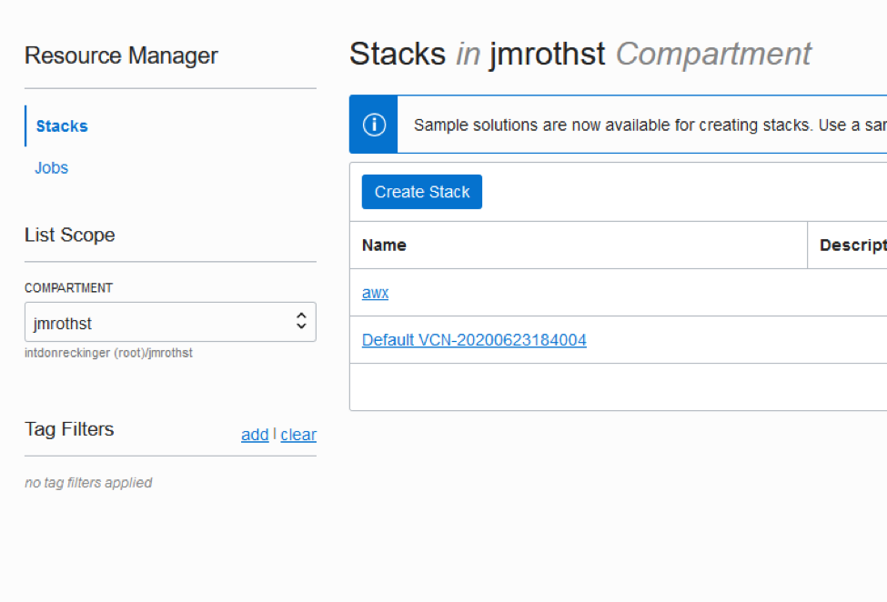
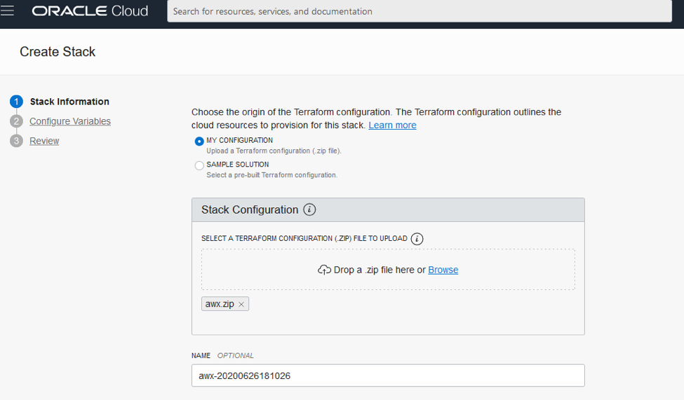
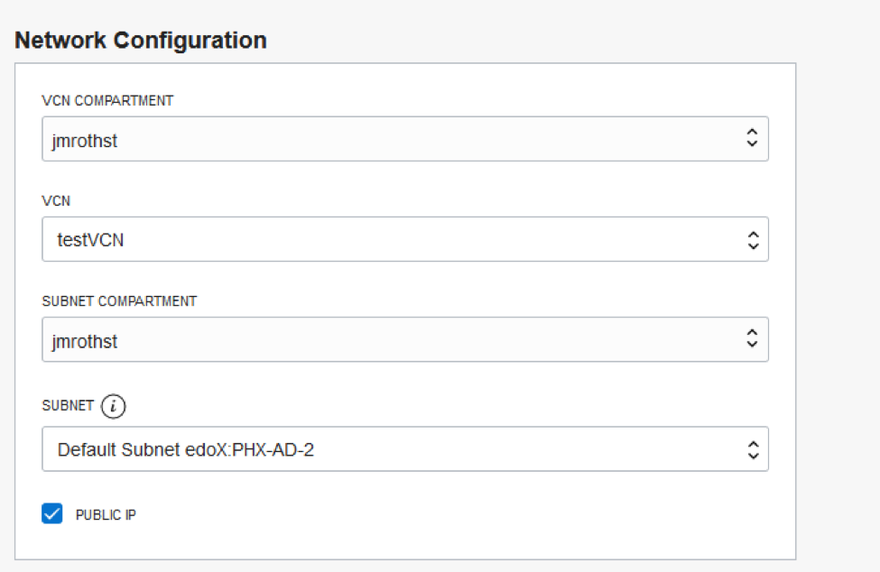
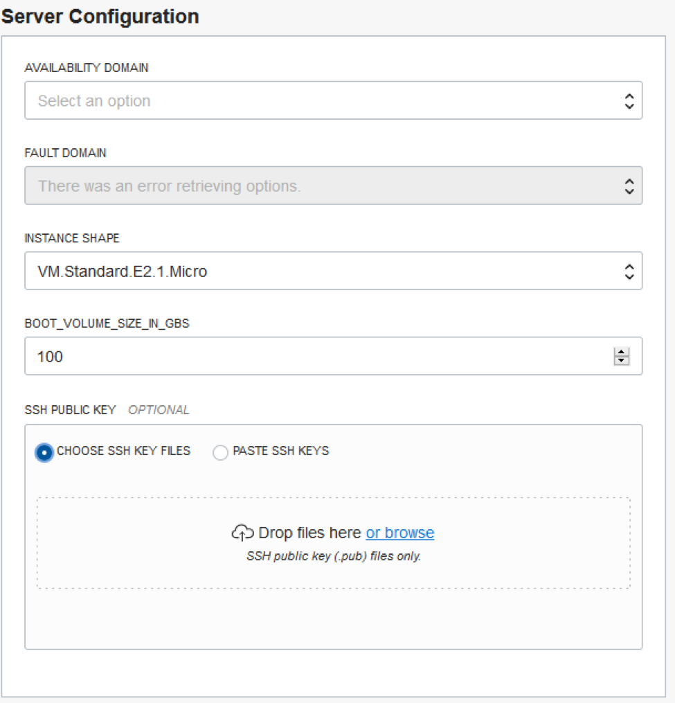
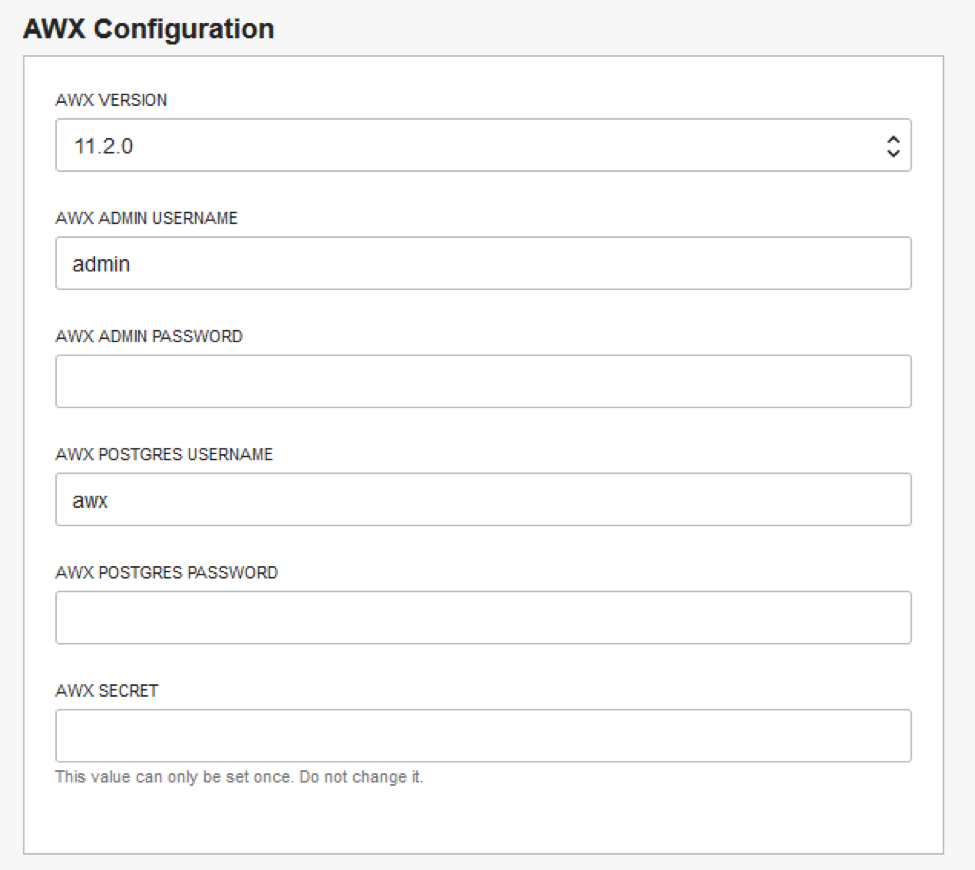
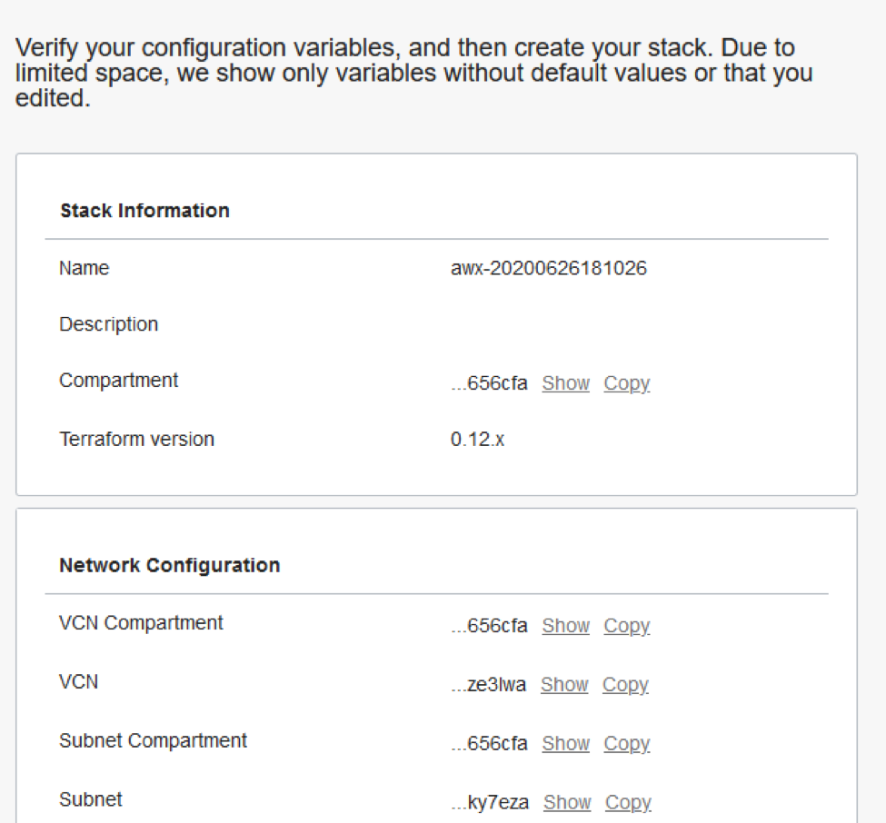
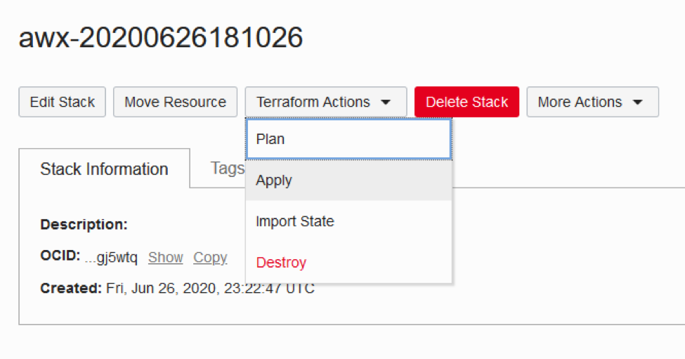
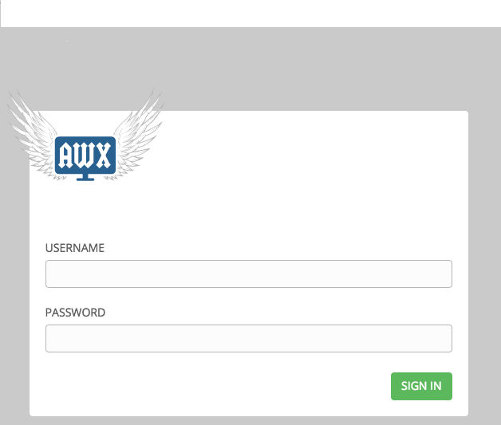

# Ansible AWX on Oracle Cloud Infrastructure

Ansible AWX provides a web-based user interface, REST API, and task engine built on top of Ansible. It is the upstream project for [Tower](https://www.ansible.com/products/tower), a commercial derivative of AWX.

This solution creates an OCI compute instance and deploys AWX on it. The solution can be deployed using OCI resource manager.

# Quick Start

# Table of Contents

- Current Features
- Requirements
- Stack Deployment
- Accessing AWX
- Using AWX
- License

# Current Features

- Installs user determined AWX release with support for 12.0.0, 13.0.0 and 14.0.0
- User determined credentials to manage AWX, PostgreSQL, and the AWX Secret key
- Backup & Restore is supported by usage of tower-cli
- AWX Version Upgrades may be performed via backup & restore process
- Uses OCI Platform image Oracle Linux 7.8 from June 2020 is used and supported in all regions.
- OCI OS Management agent is deployed (requires policy deployment)
- Cloud Init used to enable the following: OS patch on first boot, Daily OS patch via yum-cron, OS Firewall enabled for ingress tcp/80 and tcp/443 via Firewall

# Requirements

Access needed during the provisioning process: 
- https://github.com to deploy AWX via git clone
- https://hub.docker.com to download required containers
- https://pypi.org to download required Python2 based Ansible, Docker Compose, and supporting tools

## OCI Policy Statements

Ensure the user has access to OCI Resource Manager, Create VM, and Enumerate OCI VCN/Subnet resources.

## OCI Networking configuration 

Ensure a pre-existing working VCN/Subnet/SecurityList configuration is in place with the following access:

1.	To access AWX Web UI
-	Ingress to 0.0.0.0/0 on tcp/80 *(If this is not enabled, the AWX website won't load)*
-	Ingress to 0.0.0.0/0 on tcp/443 (TLS Certificate managed by LBaaS)

2. To interact with OCI API, Ansible Galaxy, git repo, and other integrations
-	Egress to 0.0.0.0/0 on tcp/22
-	Egress to 0.0.0.0/0 on tcp/80
-	Egress to 0.0.0.0/0 on tcp/443

3. To manage Linux OS (and Windows OS with native OpenSSH), recommend 
- Egress to 0.0.0.0/0 on tcp/22

4. To manage Windows OS (via WinRM), recommend 
-	Egress to 0.0.0.0/0 on tcp/5985-5986

# Stack Deployment

1.	Login to OCI, and select target Region and Compartment
2.	Create VCN, Subnet, and Security List if required
3.	Navigate to Menu → Resource Manager → Stacks
4.	Verify the Region displayed in the top bar is correct, and the compartment on the left is correct for where to place the Instance, change as required
5.	Select the "Create" button 

6. Download this github repo as a zip file (Click on Code from top right and select Download ZIP)
7. Upload the oci-ansible-awx.zip file and fill out page 1 of the form 

8.	Please now go to next page
9.	Please configure the networking parameters first. Compartment will be needed before you may select a VCN or Subnet, and they may be different values. This will accomodate the use case where network is managed by a dedicated team, and servers by a different dedicated team. If the subnet is Public, you may select the box for Public IP to be assigned. Firewall rules to lock this down will be required.

10.	Please configure the server details next. Here we select the availability domain, fault domain, shape, boot volume size, and optionally add the SSH key for "opc" user. It is recommended to NOT provide the SSH Key. 

11.	Please configure the AWX values. Note that we currently have support for 3 versions of AWX, and this may change in the future. Note that these values once set, may NOT be changed for the life of this AWX instance. Changing them requires backup, destroy, create new, and restore operation.

12.	Please go to the next page to review and confirm the values are as desired 

13.	Now press "Create" and the stack is ready to deploy
14.	Now you may "Apply" the configuration 

15.	*Wait approximately 15-20 minutes after the apply operation completes*

# Accessing AWX
1.	Browse to http://<public_ip>:80 and you will now be able to access/configure users, projects, inventory, and more
Using AWX. For more info, check [Ansible Tower User Guide](https://docs.ansible.com/ansible-tower/latest/html/userguide/index.html).

# License
The AWX source code is available under the Apache License 2.0.

The code and scripts in this solution are available under the UPL [license](LICENSE).
